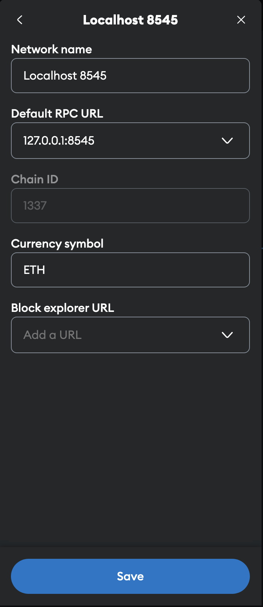

# XXX

## Table of Contents

- [Setup](#setup)
  - [1. Reset MetaMask](#1-reset-metamask)
- [Running the Project](#running-the-project)
  - [1. Start Hardhat Node](#1-start-hardhat-node)
  - [2. Deploy Contracts](#2-deploy-contracts)
  - [3. Start the Application](#3-start-the-application)
- [Troubleshooting](#troubleshooting)
- [License](#license)


## Prerequisites

Before you begin, ensure you have the following installed on your machine:

- [Node.js](https://nodejs.org/) (v14 or later)
- [npm](https://www.npmjs.com/)
- [MetaMask](https://metamask.io/) extension in your browser

## Setup

### 1. Reset MetaMask

To ensure a clean state and avoid any potential issues with cached data, reset your MetaMask account.

1. Open MetaMask in your browser.
2. Click on the account icon and navigate to **Settings**.
3. Go to **Advanced**.
4. Scroll down and click on **Clear Activity Tab Data**.
5. Set up new network
 


## Quick start

Once installed, let's run Hardhat's testing network:

```sh
npx hardhat node
```

Then, on a new terminal, go to the repository's root folder and run this to
deploy your contract:

```sh
npx hardhat run scripts/deploy.js --network localhost
```


> Note: this example uses a custom deploy script, consider using `hardhat ignition` -
> Hardhat builtin deployment system

Connect Metamask to a local network through Settings > Networks > Add Network.
You might need to delete previously added network from Metamask and re-add it 
every time you start a new network instance. Please do so if you get "Transaction
#x failed! JSON-RPC error." in Metamask


Finally, we can run the frontend with:

```sh
cd frontend
npm install
npm start
```

Open [http://127.0.0.1:3000/] to see your Dapp. You will
need to have [Metamask](https://metamask.io) installed and listening to
`localhost 8545`.

## Acknowledgements and other resources

This Dapp used the [Hardhat boilerplate project tutorial](https://hardhat.org/tutorial/boilerplate-project). as a starting point. Please refer to the tutorial and original repo for additional informations on how to use Hardhat with React, etherjs and Metamask.

